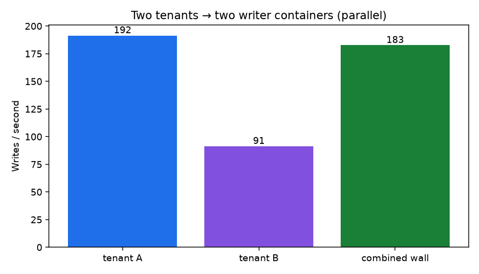

# Distributed SQLite on Modal

Multi-tenant SQLite over [Modal](https://modal.com) Class RPC: one named database → one writer container, many callers via `.remote` / `.remote.aio`.

| File | Role |
|------|------|
| [`sqlite.py`](sqlite.py) | `SqliteDatabase` — local-hot DB, Volume durability, `execute` / `executemany` / `query` |
| [`api.py`](api.py) | FastAPI Notes API — `/t/{tenant_id}/notes` |
| [`seed.py`](seed.py) | Seed demo notes |
| [`bench.py`](bench.py) | Load tests + README charts |
| [`models.py`](models.py) | SQLAlchemy schema (Alembic) |

## Pattern

```text
HTTP / workers  --.remote.aio-->  SqliteDatabase(db_name=tenant-…)  [max_containers=1]
                                    ├─ hot:     /tmp/sqlite/{db}.db
                                    └─ durable: Volume /data/{db}.db
                                       (hydrate on enter · flush on exit)
```

Different `db_name`s run on different containers in parallel. Do not share one `.db` across writer containers — Volumes are not a multi-writer filesystem for SQLite.

## Quickstart

```bash
uv sync
uv run modal serve api.py
```

```bash
export URL=https://…   # printed by modal serve

curl "$URL/health"
curl -X POST "$URL/t/acme/notes" -H 'content-type: application/json' \
  -d '{"body":"hello"}'
curl "$URL/t/acme/notes"
curl "$URL/t/globex/notes"
```

```bash
uv run modal run seed.py
uv run modal run bench.py          # load tests + regenerates docs/charts/*.png
```

## Schema

1. Edit `models.py`
2. `uv run alembic revision --autogenerate -m "…"`
3. Redeploy — each DB runs `alembic upgrade head` on `@modal.enter`

## Benchmarks

`bench.py` drives **client-perceived Class RPC** load the same way the API does (`async` gather + semaphore), with:

- Warm containers and discarded warmup ops
- ~250 byte note payloads (not tiny strings)
- Seeded tables before point/list/mixed reads
- p50 / p95 / p99 latency and error counts
- Tenant isolation check (must pass)
- Single-row writes, point reads, list reads, mixed 30/70 R/W, `executemany` batches, two-tenant parallelism

Latest run (concurrency=64, 500 seed rows):

| Scenario | Throughput | p50 | p95 | p99 | Errors |
|----------|------------|-----|-----|-----|--------|
| Single-row writes | 122 ops/s | 483 ms | 592 ms | 710 ms | 0 |
| Point reads | 121 ops/s | 497 ms | 700 ms | 765 ms | 0 |
| List reads (LIMIT 50) | 103 ops/s | 554 ms | 753 ms | 795 ms | 0 |
| Mixed 30% W / 70% R | 94 ops/s | 591 ms | 988 ms | 1113 ms | 0 |
| Batch writes (200/RPC) | **539 rows/s** | — | — | — | 0 |
| Two tenants (parallel wall) | **183 ops/s** combined · ~192 + ~91 per tenant | — | — | — | 0 |
| Isolation | pass | | | | |

Single-row throughput is dominated by **Modal RPC round-trip** (~0.5 s p50), not SQLite. Batch with `executemany` when you can; scale tenants with distinct `db_name`s.




## Design notes

- `@modal.concurrent`: each call opens a short-lived connection; WAL + `busy_timeout` serialize writers (no Python lock / connection pool).
- Hot file on local disk for commit latency; Volume is the durable copy across container restarts.
- Durability window is container lifetime — `wal_checkpoint` + copy + `volume.commit()` on `@modal.exit`.
- Leave Class-wide `min_containers` unset (cost × number of tenants).
