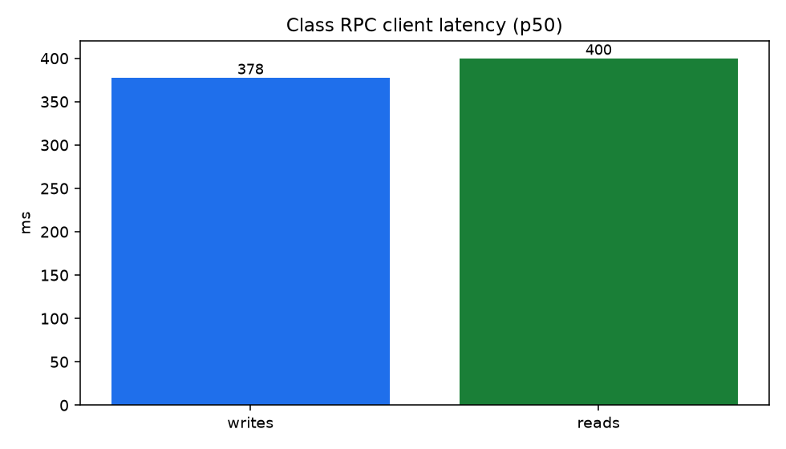
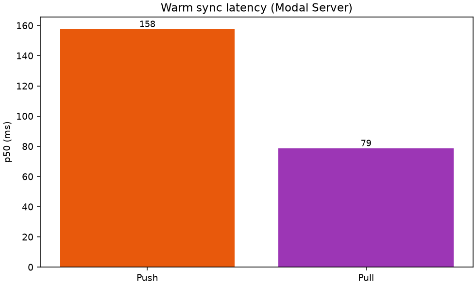
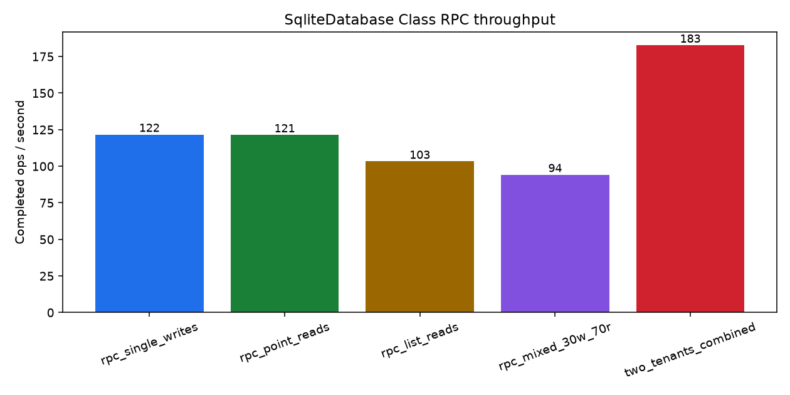

# sqlite-modal

Named [Turso Sync](https://docs.turso.tech/sync) databases on
[Modal](https://modal.com). Local SQL via pyturso; `push` / `pull` to a
`tursodb` Server in your workspace. Volume holds `server.db` on exit.

You create named DBs in your Modal workspace. This is not a managed
multi-tenant service.

```text
local file  --push/pull-->  SyncServer (tursodb)
                                |
                         exit → Volume /data/{name}/
```

## Install

Python >= 3.12 and a Modal account (`modal setup`).

```bash
uv add git+https://github.com/modal-projects/sqlite-modal.git
```

Deploy from a checkout (or editable install) so Image builds can
`add_local_python_source("sqlite_modal")`. PyPI is not set up yet.

```bash
uv sync
uv sync --group dev    # tests / lint
uv sync --group bench  # charts
```

## Usage

```python
from sqlite_modal import Sqlite

db = Sqlite.from_name(
    "orders",
    create_if_missing=True,
    create_options={"max_containers": 1},  # recommended
)
conn = db.connect("./orders.db")
with conn:
    conn.execute("CREATE TABLE IF NOT EXISTS t (v TEXT)")
    conn.execute("INSERT INTO t VALUES (?)", ("a",))
    conn.commit()
    conn.push()
    conn.pull()
```

- `from_name` creates or looks up App `sqlite-modal-{name}` (`create_options` → `@app.server`)
- `connect(path)` opens a local `ConnectionSync` and waits until the Server is up
- Sync is explicit (`push` / `pull`). Conflicts are last-push-wins.
- Prefer `max_containers=1`. Use `min_containers=1` if you don't want cold starts.
- The sync URL is unauthenticated. Anyone who has it can `push` / `pull`.
- Volume persist runs when the Server exits.

## Examples

```bash
uv run python examples/notes/app.py
uv run python examples/multi/app.py
```

| Kit | When |
|-----|------|
| [`examples/notes/`](examples/notes/) | One named DB |
| [`examples/multi/`](examples/multi/) | Two Apps, two names |

## Development

```bash
uv run pytest
uv run ruff check sqlite_modal examples benchmarks tests
uv run ty check sqlite_modal examples benchmarks tests

uv run python benchmarks/app.py --create-remotes  # once
uv run python benchmarks/app.py
uv run python benchmarks/app.py --cold            # optional
```

Details: [benchmarks/README.md](benchmarks/README.md).

## Benchmarks

`uk` / `eu-west`, warm `bench` (`min_containers=1`):

| | |
|--|--|
| Local read / write p50 | ~0.01 ms / ~0.09 ms |
| Local read / write ops/s | ~121k / ~9.3k |
| Warm push / pull p50 | ~158 ms / ~79 ms |







## License

[Apache License 2.0](LICENSE)
