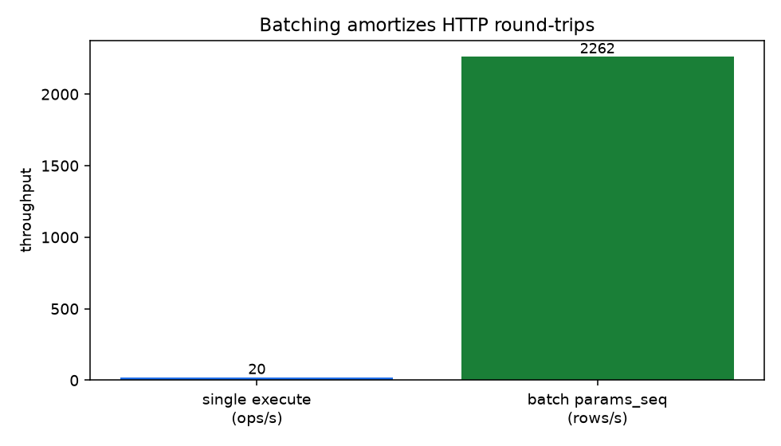
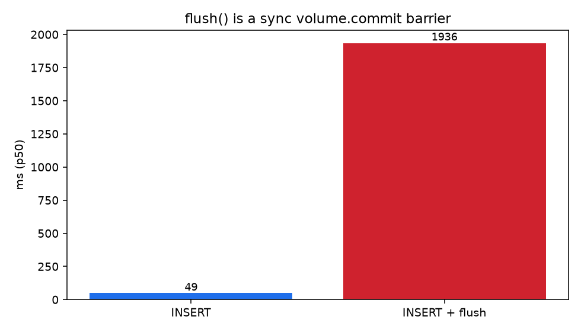

# sqlite_modal

Named SQLite on Modal Servers: `from_name` → `attach` → HTTP SQL.

Internal library for Modal apps that need durable per-name SQLite with an
exclusive writer. Clients talk HTTP; the Server owns the Volume.

## Overview

Each named DB is one Modal Server (`SqliteServer_{name}`) plus Volume
`{name}-data` mounted at `/data`. Scale **clients** (Functions, workers);
keep **one writer** (`min_containers` 0 or 1). Do not mount that Volume for
writes from many containers.

```text
local / workers  ──HTTP──►  SqliteServer_{name}  ──►  Volume {name}-data
                             min_containers 0|1         /data/db.sqlite
```

### Dependencies

- **Upstream:** Modal account, proxy tokens (`wk-` / `ws-`)
- **Runtime:** `httpx`, `modal`; Server image adds FastAPI + uvicorn

## Setup

### Prerequisites

- Python 3.12+
- [uv](https://docs.astral.sh/uv/)
- `modal setup`

### Environment

| Variable | Description |
|----------|-------------|
| `MODAL_PROXY_TOKEN_ID` | Proxy token id (`wk-…`) |
| `MODAL_PROXY_TOKEN_SECRET` | Proxy token secret (`ws-…`) |

```bash
modal workspace proxy-tokens create
export MODAL_PROXY_TOKEN_ID=wk-…
export MODAL_PROXY_TOKEN_SECRET=ws-…
modal workspace proxy-tokens allow "$MODAL_PROXY_TOKEN_ID" main
```

### Install / tests

```bash
uv sync
uv run pytest
uv run ruff check sqlite_modal examples benchmarks tests
uv run ty check sqlite_modal examples benchmarks tests
```

## Usage

```python
import modal
from sqlite_modal import Sqlite

app = modal.App("my-app")

db = Sqlite.from_name("orders")
db.attach(app, region="eu-west", cloud="aws")

@app.local_entrypoint()
def main() -> None:
    db.execute(
        "CREATE TABLE IF NOT EXISTS t (id INTEGER PRIMARY KEY, v TEXT NOT NULL)"
    )
    db.executemany("INSERT INTO t (v) VALUES (?)", [["a"], ["b"], ["c"]])
    print(db.query("SELECT id, v FROM t ORDER BY id"))
    db.flush()  # optional; ~seconds — Volume also background-commits
    db.close()
```

Names: `^[A-Za-z][A-Za-z0-9_]{0,127}$`. Params: JSON scalars only (no BLOB).

### API

| Member | Role |
|--------|------|
| `from_name(name, *, timeout=, max_retries=)` | Named DB → `{name}-data` |
| `attach(app, region=, cloud=, min_containers=0\|1, …)` | Register Server |
| `query` / `execute` | One statement / one HTTP RTT |
| `executemany` / `batch` | Bulk / one RTT |
| `flush` | Sync `volume.commit` barrier |
| `close` | Close HTTP client |
| Exceptions | `InvalidNameError`, `NotAttachedError`, `AlreadyAttachedError`, `AuthError`, `SqlError`, `ServiceError` |

`sqlite_modal.db.Database` is Server-internal — not an app API.

## Architecture

| Path | Purpose |
|------|---------|
| `sqlite_modal/client.py` | Public `Sqlite` HTTP client |
| `sqlite_modal/server.py` | Modal Server (Popen uvicorn) |
| `sqlite_modal/api.py` | FastAPI SQL routes |
| `sqlite_modal/db.py` | Local sqlite3 + Volume commit |
| `examples/notes/` | Single-DB smoke |
| `examples/multi/` | Two DBs on one App |
| `benchmarks/` | Live latency / throughput |
| `docs/charts/` | PNGs from last bench run |

## Runbooks

### Smoke

```bash
uv run modal run examples/notes/app.py
uv run modal run examples/multi/app.py
```

### Benchmarks + charts

```bash
uv run modal run benchmarks/app.py
# writes benchmarks/results/latest.json (gitignored)
# and docs/charts/*.png (committed)
```

Regenerate charts from an existing report:

```bash
uv run python -c "import json; from pathlib import Path; from benchmarks.charts import render_charts; render_charts(json.loads(Path('benchmarks/results/latest.json').read_text()))"
```

## Gotchas

| Topic | Detail |
|-------|--------|
| Latency | Hot path ≈ Modal HTTP RTT (tens of ms), not SQLite |
| Bulk | Prefer `executemany` / `batch` over loops of `execute` |
| `flush()` | ~seconds; skip unless you need a sync durability point |
| Warmth | `min_containers=0` cold-starts; use `1` for demos/benches |
| Multi-writer | Never write the same Volume from scaled Functions |

## Latest bench snapshot (eu-west)

| Metric | p50 / rate |
|--------|------------|
| health / SELECT 1 / INSERT | ~43–45 ms |
| Sequential write / read | ~21 ops/s |
| `params_seq` batch (100 rows) | ~2260 rows/s |
| INSERT + `flush` | ~1.9 s |





